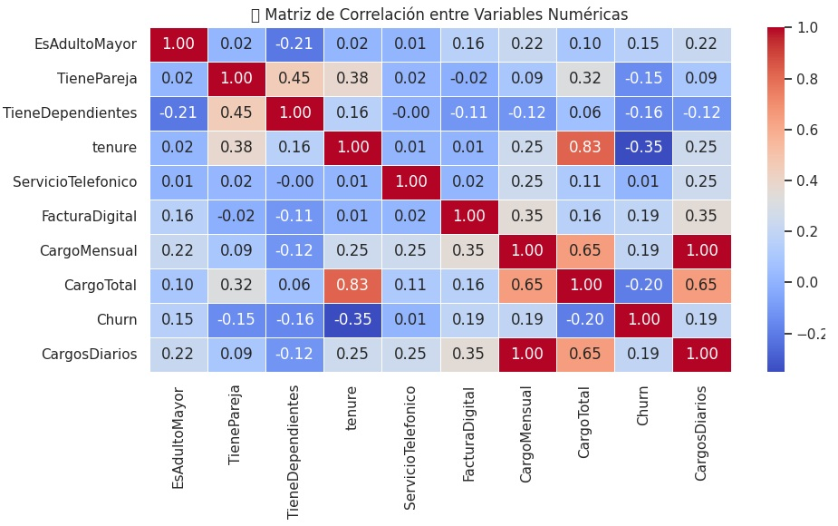

# 📊 Telecom X - Análisis de Evasión de Clientes (Churn)

Este proyecto tiene como objetivo identificar patrones de evasión de clientes en el servicio de telecomunicaciones Telecom X.  
Mediante el análisis exploratorio de datos (EDA), buscamos comprender qué características están más asociadas con la cancelación del servicio, y así proponer estrategias para mejorar la retención de clientes.

---

## 🎯 Propósito del Análisis

La empresa enfrenta una alta tasa de cancelación de clientes.  
A través de este análisis se pretende:

- Comprender el comportamiento de los clientes que cancelan el servicio.
- Identificar variables relevantes que influyen en el churn.
- Visualizar la distribución y relaciones entre variables.
- Proponer acciones estratégicas basadas en datos.
- Sentar las bases para un modelo predictivo de evasión de clientes.

---

## 📁 Estructura del Proyecto

```
TelecomX_Cliente_Churn/
│
├── TelecomX_LATAM.ipynb         # Notebook principal con todo el análisis
├── TelecomX_Data.json           # Archivo original con los datos crudos
├── TelecomX_diccionario.md      # Diccionario de datos con descripción de columnas
├── README.md                    # Este archivo
├── imagenes/                    # Carpeta con ejemplos de visualizaciones generadas
│   ├── churn_distribucion.jpg
│   ├── churn_vs_tenure.jpg
│   ├── churn_vs_cargomensual.jpg
│   └── matriz_correlacion.jpg
```

---

## 📸 Ejemplos de Gráficos e Insights Obtenidos

### 1. Distribución de Churn


**Insight:** La mayoría de los clientes permanecen activos, pero hay una proporción considerable que cancela.

---

### 2. Relación entre `tenure` y `Churn`


**Insight:** Los clientes que llevan poco tiempo en la empresa (menos de 12 meses) tienen una tasa de churn significativamente mayor.

---

### 3. Relación entre `CargoMensual` y `Churn`


**Insight:** Clientes con cargos mensuales elevados tienen mayor propensión a cancelar.

---

### 4. Matriz de Correlación



**Insight:** El `tenure` tiene la correlación más negativa con `Churn`, mientras que `CargoMensual` y `CargosDiarios` tienen correlación positiva.

---

## ⚙️ Instrucciones para Ejecutar el Proyecto

1. Clona este repositorio:

```bash
git clone https://github.com/tu-usuario/TelecomX_Cliente_Churn.git
```

2. Abre el archivo `TelecomX_LATAM.ipynb` en Jupyter Notebook, Google Colab o VSCode con Jupyter.

3. Asegúrate de tener instaladas las siguientes librerías de Python:

```bash
pip install pandas matplotlib seaborn openpyxl
```

4. Ejecuta las celdas del notebook en orden.  
   Las gráficas se generarán automáticamente y se guardarán en la carpeta `imagenes/`.

---

## ✍️ Autor

Luz Elena Campos Díaz  
Proyecto desarrollado como parte del reto de análisis de datos para Telecom X (Churn de Clientes).
